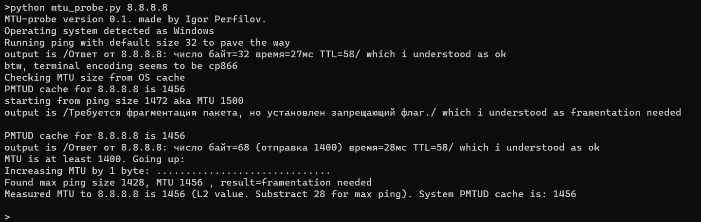

# MTU Lookup

Script to check network MTU, detect blackhole, and check system PMTUD cache using standard Python libraries. Icecream output is optional.



Required system utilities:
- `ping` utility
- `ip` utility on Linux
- `netsh` utility on Windows

## Install
```sh
git clone https://github.com/ChieftainGreen/mtu_lookup
```
Or
Copy-paste `mtu_lookup.py` to a local .py file

For icecream debug output, install icecream:
```sh
pip install icecream  # (or pip3...)
```
And comment out the `HAVE_IC = False` line

## Usage
```sh
python3 mtu_probe.py <ip or hostname>  # - Linux
python mtu_probe.py <ip or hostname>    # - Windows
```

## Notes on using system "ping"
### PROS
- Available without root/admin privileges
- Available without other Python modules or external programs (e.g., scapy requires Npcap on Windows)

### CONS
- Different output for Linux or Windows
- No reliable error code
- Windows version may be localized
- Linux version has no clear 'timeout' message

## TODO (Checkboxes)
- [ ] Jumbo Frames
- [ ] Resolve problem with hostname containing "ttl" substring
- [ ] Colored Rich version
- [ ] Better no-icecream fallback (no manual commenting)

## Author
Igor Perfilov ([GitHub](https://github.com/ChieftainGreen)). AI also deserves a cookie. 🍪

## LICENSE
MIT
